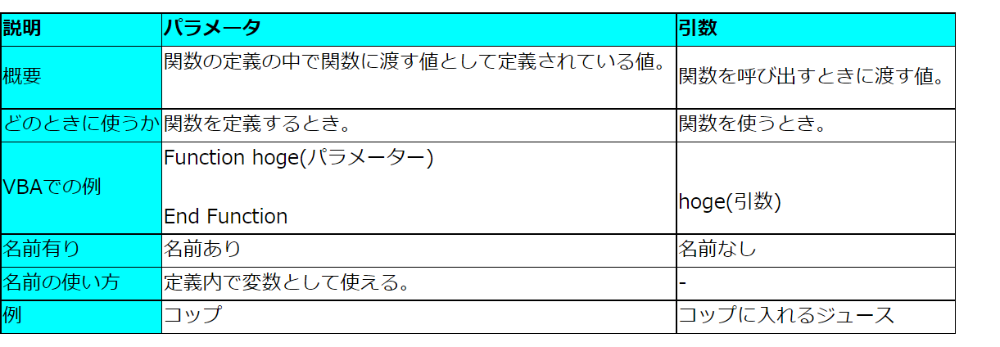

# jetpack composeの基本

****

## プロジェクト作成

****

- build.gradle ファイルと app/build.gradle ファイルには、Compose に必要なオプションと依存関係が含まれています。

## コンポーズ可能な関数

****

コンポーズ可能な関数とは、@Composable アノテーションが付いている通常の関数。よって、関数は内部で他の @Composable 関数を呼び出すことができる
Greeting 関数が @Composable とマークされている例を次に示します。
この関数では UI 階層の一部が生成され、指定された入力（String）がその UI 階層で表示されます。Text は、ライブラリによって提供されるコンポーズ可能な関数です。

## Androidアプリでのcompose

****

- Activitiesはandroidのエントリーポイント
- ユーザーがアプリを開くとMainActivityが起動する（AndroidMainfestの設定どおり）
- レイアウトはxmlではない！内部のcompose可能な関数を呼び出す!

- BasicsCodelabTheme は、コンポーズ可能な関数のスタイルを設定する手段
- Android Studio プレビューを使用するには、※パラメータのないコンポーズ可能な関数またはデフォルト パラメータを含む関数に @Preview アノテーションを付けて、プロジェクトをビルドします。
- 同じファイルに複数のプレビューを設定し、それぞれに名前を付けることができます。

※パラメータとは

### UIの微調整

****

Surface 内にネストされているコンポーネントは、その背景色の上に描画されます。

- 結果

テキストを指定してないのに文字の色が白い。なぜか。（河田構文）

実は、定義していません。androidx.compose.material.Surface などのマテリアル コンポーネントは、
テキストに適切な色を選択するなど、一般的にアプリに望まれる内容を指定することで、ユーザー エクスペリエンスが向上するように設計されている

化け物だ

ちなマテリアルは、大半のアプリに通用する適切なデフォルト値とパターンを提供するものであるため、柔軟性がありません。

Compose のマテリアル コンポーネントは、他の基盤コンポーネント（androidx.compose.foundation にあるコンポーネント）の上に構築されており、より柔軟性が必要な場合は、アプリ コンポーネントからもアクセスできます。

今回の場合は背景が primary カラーに設定されており、
その際には背景の上にあるテキストに onPrimary カラー（これはテーマでも定義されています）
を使用すべきであることが、Surface によって認識されておるのだ

### 修飾子

****
Surface や Text といったほとんどの Compose UI 要素はね。省略可能な modifier パラメータを使って
UI 要素に対して親レイアウト内での配置、表示、動作を命令できるのだ。

よってtextにmodifierを追加し、paddingの効果発動！！

背景色を拡大することが出来るのだ！！

### コンポーザブルを再利用する

****

UI に追加するコンポーネントが多くなると、作成するネストのレベルが増えます
関数が非常に大規模なものになる場合、読みやすさに影響する可能性がでるんだよね。

再利用可能な小さいコンポーネントを作成すると、アプリで使用する UI 要素のライブラリを簡単に構築できます。

UI 要素は、それぞれで画面の一部を処理し、個別に編集ってことができるわけ

### 列と行の作成

****
アーニャここよく忘れる

これらのコンポーザブルは、コンポーズ可能なコンテンツを受け取るコンポーズ可能な関数であり、
内部にアイテムを配置できます。たとえば、Column 内のそれぞれの子は縦方向に配置されます。

使用例だとこんな感じ

#### Compose と Kotlin

****

コンポーズ可能な関数は、Kotlin の他の関数と同様に使用できます

つまりUI の表示方法に影響を与えるステートメントを追加できるので、UI の作成が非常に容易することが可能！！

この技を使ってこんなことができる↓

