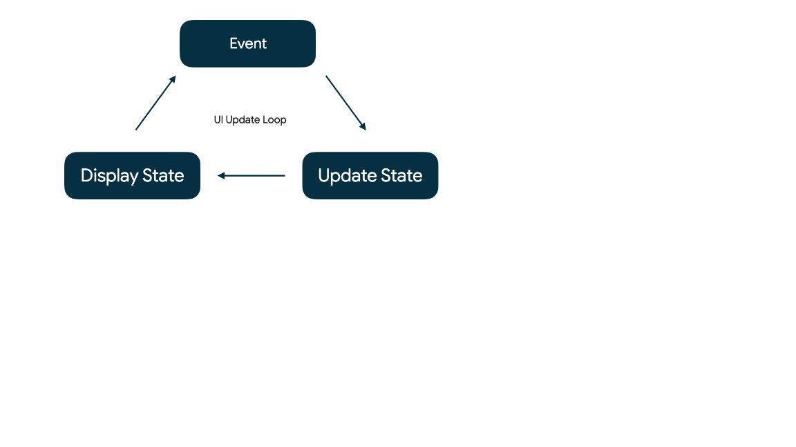

# viewmodel概要

****

アプリを落とす前に追加したデータを更新や削除することができない

## 解決策

わからん

調べてもでてこねえから基礎を学び直すしかなし

jetpackcomposeの状態および高度な状態と副作用を徹底的に学ぶ

## 単方向データフロー

****

### Android状態の更新
Androidアプリでは、イベントに応答して状態が更新される

イベントとはアプリ外で生成された入力であり、OnClickListener を呼び出すボタンをユーザーがタップする操作、
EditText による afterTextChanged の呼び出し、加速度計による新しい値の送信など

### UI更新ループ

****

すべてのAndroidアプリは、このUI更新ループを備えています



- イベント- ユーザーまたはプログラムの要素によってイベントが生成されます
- 状態の更新 - イベント　ハイドラがUIで使用される状態を変更
- 状態の表示 - UIが更新され、新しい状態を表示する

### composeとviewmodel

****

最終的にこんなアプリができます


Todoscrreen.kt

```kotlin
@Composable
fun TodoScreen(
   items: List<TodoItem>,
   onAddItem: (TodoItem) -> Unit,
   onRemoveItem: (TodoItem) -> Unit
) {
   /* ... */
}
```

このコンポーザブルは、編集可能な TODO リストを表示しますが、それ自体の状態はありません。変更可能な値が状態でしたが、TodoScreen の引数はどれも変更できません。

- items 画面に表示するアイテムの不変のリスト
- onAddItem ユーザーがアイテムの追加をリクエストしたときのイベント
- onRemoveItem ユーザーがアイテムの削除をリクエストしたときのイベント

このcomposableはステートレスなので、渡されたアイテムリストが表示されるだけで、リストを直接編集不可

じゃあどうやるかって？変更をリクエストできる 2 つのイベント onRemoveItem と onAddItem が渡せばおｋ

ステートレスな場合に編集可能なリストの表示方法は*状態ホイスティング*と呼ばれる技を使え！！

状態ホイスティングとは、コンポーネントをステートレスにするために状態を移動するパターンです。ステートレスなコンポーザブルはテストが簡単で、通常はバグが少なく、再利用の機会を数多く提供

上記のパラメータの組み合わせで、呼び出し元がこのコンポーザブルから状態をホイスティングできるようになることがわかります

- イベント - ユーザーがアイテムの追加または削除をリクエストしたときに、TodoScreen が onAddItem または onRemoveItem を呼び出します。
- 状態の更新 – TodoScreen の呼び出し元で状態を更新することにより、上記のイベントに応答できます。
- 状態の表示 - 状態が更新されると、新しい items とともに TodoScreen が再度呼び出され、新しいアイテムが画面に表示されます。

### TodoActivityScreen コンポーザブルを定義する

****

TodoViewModel.kt を開き、1 つの状態変数と 2 つのイベントを定義している ViewModel を確認

Todoviewmodel

```kotlin

class TodoViewModel : ViewModel() {

    // state: todoItems
    private var _todoItems = MutableLiveData(listOf<TodoItem>())
    val todoItems: LiveData<List<TodoItem>> = _todoItems

    // event: addItem
    fun addItem(item: TodoItem) {
        /* ... */
    }

    // event: removeItem
    fun removeItem(item: TodoItem) {
        /* ... */
    }
}
```

このviewmodelを使いTodoScreenから状態ホイスティングを行う。これで次のような単方向データフロー設計を作成


todoscreenをtodoActivityに統合するためにTodoActivity.kt を開き、新しい @Composable 関数 TodoActivityScreen(todoViewModel: TodoViewModel) を定義して、それを onCreate の中の setContent から呼び出します。

TodoActivity.kt

```kotlin

import androidx.compose.runtime.Composable

class TodoActivity : AppCompatActivity() {

   private val todoViewModel by viewModels<TodoViewModel>()

   override fun onCreate(savedInstanceState: Bundle?) {
       super.onCreate(savedInstanceState)
       setContent {
           StateCodelabTheme {
               Surface {
                   TodoActivityScreen(todoViewModel)
               }
           }
       }
   }
}

@Composable
private fun TodoActivityScreen(todoViewModel: TodoViewModel) {
   val items = listOf<TodoItem>() // in the next steps we'll complete this
   TodoScreen(
       items = items,
       onAddItem = { }, // in the next steps we'll complete this
       onRemoveItem = { } // in the next steps we'll complete this
   )
}
```

このcomposableにより、viewmodelに格納されている状態と、プロジェクトで定義済みのTodoscreenコンポーサブルの橋渡しを行います。


を直接取得するように TodoScreen を変更することは可能ですが、TodoScreen が少し再利用しにくくなります。List<TodoItem> のような単純なパラメータを選ぶことで、TodoScreen と状態がホイストされる場所とを切り離すことができます

### イベントを上に流す

****

必要なコンポーネント(ViewModel、ブリッジ コンポーザブル TodoActivityScreen、TodoScreen)が
が揃ったので、すべてを接続し、単方向データフローを使用する動的なリストを表示します

TodoActivityScreen で、ViewModel から addItem と removeItem を渡します。

TodoActivity.kt

```kotlin

@Composable
private fun TodoActivityScreen(todoViewModel: TodoViewModel) {
   val items = listOf<TodoItem>()
   TodoScreen(
       items = items,
       onAddItem = { todoViewModel.addItem(it) },
       onRemoveItem = { todoViewModel.removeItem(it) }
   )
}
```
TodoScreen に渡されるイベントでは、Kotlin のラムダ構文を使用

TodoScreen が onAddItem または onRemoveItem を呼び出すとき、ViewModel の適切なイベントへの呼び出しを渡すことができます。

### 状態を下に渡す

****

単方向データフローのイベントを接続し終わったので、次は状態を下に渡す必要があります

TodoActivityScreen を編集し、observeAsState を使用して todoItems LiveData を監視するようにします


TodoActivity

```kotlin
import androidx.compose.runtime.getValue
import androidx.compose.runtime.livedata.observeAsState

@Composable
private fun TodoActivityScreen(todoViewModel: TodoViewModel) {
   val items: List<TodoItem> by todoViewModel.todoItems.observeAsState(listOf())
   TodoScreen(
       items = items,
       onAddItem = { todoViewModel.addItem(it) },
       onRemoveItem = { todoViewModel.removeItem(it) }
   )
}
```

この行では、LiveData を監視し、現在の値を List<TodoItem> として直接使用できるようにします

解説

- val items: List<TodoItem> では、List<TodoItem> 型の変数 items を宣言しています。
- todoViewModel.todoItems は、ViewModel から取得した LiveData<List<TodoItem> です
- .observeAsState は、LiveData<T> を監視し、それを State<T> オブジェクトに変換して Compose が値の変更に反応できるようにします。
- listOf() は、LiveData の初期化前に null の結果となることを避けるための初期値です。渡されなかった場合、items は null 値許容の List<TodoItem>? になります。
- by は、Kotlin のプロパティ デリゲート構文であり、observeAsState の State<List<TodoItem>> のラッピングを自動的に解除して通常の List<TodoItem> にします。

observeAsState は LiveData を監視し、LiveData が変更されるたびに更新される State オブジェクトを返します。

コンポーザブルがコンポジションから削除されると、監視は自動的に停止されます

## Composeのメモリ

****

Compose が内部で状態を操作する仕組みを見てみましょう。

Compose がコンポーザブルを再度呼び出して画面が更新されることを確認しました。再コンポーズという処理です。再度 TodoScreen を呼び出すことで、動的リストを表示することができました。

```
ステートフルなコンポーザブルとは、時間とともに変化する可能性がある状態を所有するコンポーザブルです。
```

## ランダムデザイン

****


このセクションでランダムデサインを作るのでまとめてみます

### コンポーザブルにランダム要素を加える

****

TodoScreen.ktを開き、TodoRowcomposableを確認

ここでtodoリストの内の１行を表す

randommTint()の新しいval iconAlphaを定義する。デザイナーの要求通り、0.3～０．９の浮動小数点。アイコンの色合いを設定

```kotlin
import androidx.compose.material.LocalContentColor

@Composable
fun TodoRow(todo: TodoItem, onItemClicked: (TodoItem) -> Unit, modifier: Modifier = Modifier) {
   Row(
       modifier = modifier
           .clickable { onItemClicked(todo) }
           .padding(horizontal = 16.dp, vertical = 8.dp),
       horizontalArrangement = Arrangement.SpaceBetween
   ) {
       Text(todo.task)
       val iconAlpha = randomTint()
       Icon(
           imageVector = todo.icon.imageVector,
           tint = LocalContentColor.current.copy(alpha = iconAlpha),
           contentDescription = stringResource(id = todo.icon.contentDescription)
       )
   }
}
```

アイコンの色合いがランダムになったお

## 再コンポーズの確認

****

先程のrandomTintは再コンポーズの処理で、リストが変更するたびに、画面上の各行に対してrandomTintが再度呼び出されていることがわかるんよね

再コンポーズ　- 新しい入力があるとコンポーザブルを再度呼び出して、コンポーズツリーを更新する処理です。

新しいリストとともにTodoScreenが再度呼び出されると、LazyColumnが画面上の全ての子を再コンポーズします、次にTodoRow が再度呼び出され、新しいランダムな色合いが作られます。←ここコピペ

今回のtodoScreenのツリー


composeが初めてコンポジションを実行するとき、呼び出されたすべてのコンポーザブルのツリーが作成される

再コンポジション中は、呼び出された新しいコンポーザブルでツリーが更新される

TodoRowが再コンポーズされるたびにアイコンが更新されるのは、TodoRow に隠れた*副作用*があるためです。副作用とは、コンポーズ可能な関数の実行の外部に現れる変化を指します

コンポーズの再コンポーズでは副作用を発生させるべきではない


